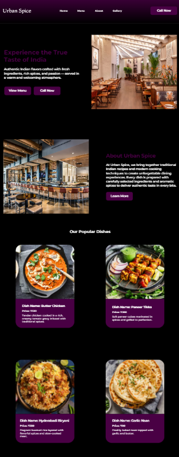
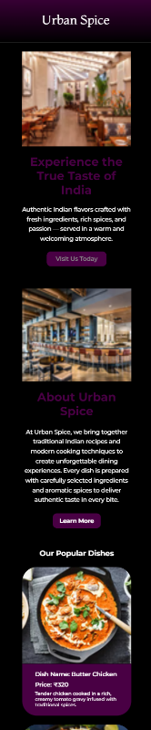

# Urban Spice – Restaurant Website UI/UX

A modern, fully responsive restaurant website designed using **Figma** and developed & published with **Framer**.

---

## 🔗 Live Website
(https://urbanspice.framer.website/)

---

## 📖 Project Overview

Urban Spice is a restaurant website concept focused on clean UI, smooth user experience, and responsive design across desktop and mobile devices.  
The project highlights real-world UX considerations such as visual hierarchy, accessibility, and clear call-to-actions.

---

## 🎯 Objectives
- Create a visually appealing restaurant website
- Improve user navigation and readability
- Ensure responsiveness across devices
- Deliver a live, production-ready website

---

## 🧠 UX Process
- User research & inspiration
- Wireframing
- UI design in Figma
- Prototyping
- Responsive testing
- Live deployment using Framer

---

## 🛠 Tools Used
- Figma
- Framer

---

## 📱 Screenshots

### Desktop View

### Mobile View

---

## 📌 Learnings
- Practical UI/UX workflow
- Responsive design principles
- Publishing live websites with no-code tools
- Improving usability through spacing and hierarchy

---

## 📬 Connect With Me
LinkedIn: (https://www.linkedin.com/in/sanjai-s-designer20/)

---

⭐ If you like this project, give it a star!
